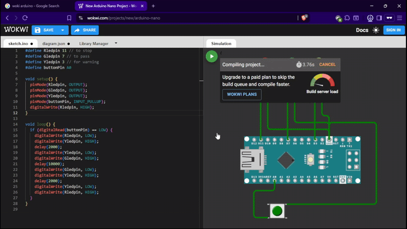

# Traffic Light Arduino Project

## How It Works

The Arduino cycles through the traffic light sequence:
1. Red LED ON For stop
2. Green LED ON For pass
3. Yellow LED ON For warning

## Demo

## License

This project is open-source and free to use.
