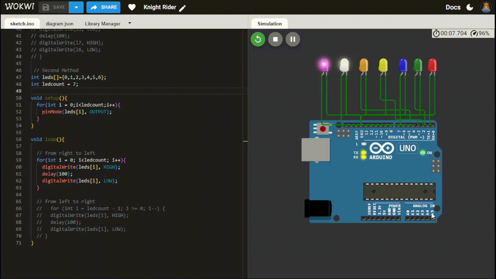

# Knight Rider Arduino Project

## How It Works

The Arduino creates a Knight Rider light effect:

- LEDs light up in sequence from left to right.
- LEDs then light up in reverse from right to left.
- The cycle repeats for a dynamic visual effect.

## Demo

## License

This project is open-source and free to use.