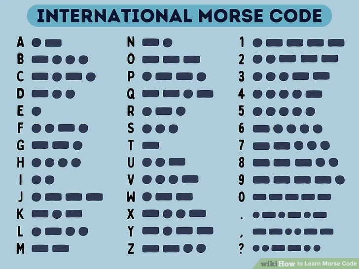

# Morse Code Arduino Project

## How It Works

The Arduino translates text into Morse code using a piezo buzzer:

- Dots and dashes are played as short and long tones.
- The buzzer outputs Morse code for any input message.
- The project demonstrates basic Morse code generation with Arduino.

## International Morse Code Chart

## Demo

[▶️ Watch Demo Video](MorseCode_ALI_.mp4)

## License

This project is open-source and free to use.